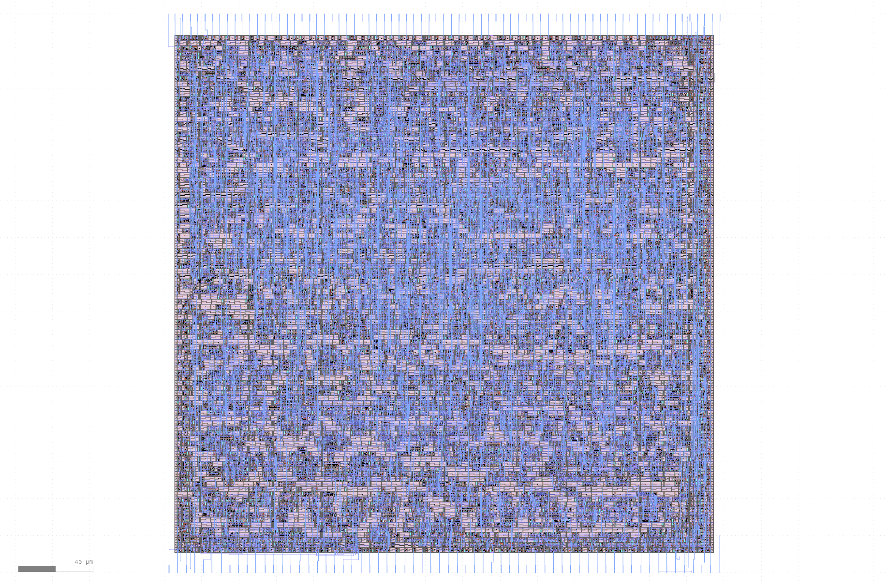

# UART ChaCha Accelerator

This is an extremely simple (technically incomplete), ChaCha20
accelerator for the MPW2-C [multi project
submission](https://github.com/mattvenn/multi_project_tools). The
accelerator is (mostly) standalone and exposes a simple UART interface.
The state of the accelerator is simply the state of the ChaCha Cipher
(i.e., a 4x4 matrix of 32-bit integers). The UART interface simply
shifts the received bytes into this state, and starts the ChaCha
permutation as soon as 64 bytes are received. The last step of the
permutation, i.e. the addition of the original permutation input to the
output, is missing. The bytes that are shifted out of the core when data
is shifted in are simply sent via UART to the host.

The UART interface is exposed on pins 8 (RXD) and 9 (TXD). The UART baud
rate can be configured via a clock divider. The value of the divider is
sampled with a simple interface, that is exposed to the logic analyser.
The second bank of the logic analyser is used to configure the core. Bit
0 is mapped to the reset of the core, pin 1 to the divider sampling
flag, and bits 2 to 21 are sampled as the divider value if the sampling
flag is high.

# License

This project is [licensed under Apache 2](LICENSE)
